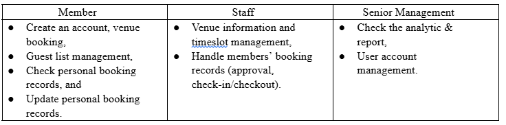

# Venue Booking System

## Overview
This project is a web–based venue booking system intended for members (and staff) to organize events. It offers venue booking, management, monitoring, tracking, and reporting features. The system is available to Senior Management (Administrator), Staff, and Members and is built using an MVC (Model–View–Controller) architecture.

## Features
- Venue booking and management (create, edit, delete, and list venues).
- Booking management (create, edit, and delete bookings).
- Guest management (create, edit, and delete guest lists).
- Income and report management (generate reports and view income details).
- User management (register, login, and manage user roles).
- MVC model system structure (separate model (beans), view (JSPs), and controller (servlets) layers).

## Project Structure
- **src/java/ict/bean:** Contains model classes (e.g., Booking, Venue, Guest, UserInfo, Report, etc.) that encapsulate data.
- **src/java/ict/servlet:** Contains controller servlets (e.g., HandleBooking, HandleVenue, LoginController, etc.) that process requests and update the model.
- **src/java/ict/db:** Contains database–interaction classes (e.g., bookingDB, venueDB, userDB, guestDB, etc.) that encapsulate database queries.
- **web:** Contains the view (JSPs) and static assets (CSS, images) for the frontend.
- **web/WEB-INF:** Contains deployment descriptors (web.xml) and (if any) external libraries.
- **build.xml:** Defines the build process (using Ant) for compiling and packaging the application.
- **img:** Contains images (e.g., data_structure.jpg) used in the documentation.

## Setup Instructions
### Prerequisites
- Java 8 (or higher) installed.
- A servlet container (e.g., Apache Tomcat 8.5 or higher) installed.
- A MySQL (or equivalent) database server installed and running.

### Steps
1. **Clone the repository:**
   (Replace the URL with your actual repository URL if needed.)
   ```bash
   git clone https://github.com/yourusername/venue_booking_system.git
   cd venue_booking_system
   ```
2. **Configure the Database:**
   - Create a database (e.g., “venue_db”) on your MySQL server.
   - (Optional) Import a schema (if provided) or create tables as per the database structure (see “img/data_structure.jpg”).
   - Update the database connection parameters (e.g., in “src/java/ict/db” classes) if necessary.
3. **Build the Project:**
   - Ensure that you have Ant installed (or use an IDE that supports Ant).
   - Run the following command in the project root (where build.xml is located) to compile and package the application:
     ```bash
     ant
     ```
   - (Alternatively, use your IDE’s “Clean and Build” option.)
4. **Deploy the Application:**
   - Copy the generated WAR file (usually located in the “dist” folder) into your Tomcat’s “webapps” folder.
   - (Alternatively, use your IDE’s “Deploy” option if available.)
5. **Start the Server:**
   - Start (or restart) your Tomcat server.
   - Open a browser and navigate to (for example) “http://localhost:8080/venue_booking_system” (adjust the context path if needed).

## Usage
- **Login:** Use the login page (index.jsp) to sign in. (Default admin credentials may be provided separately.)
- **Venue Management:** Navigate to “venue_management.jsp” (or “venue_list.jsp”) to view, create, or edit venues.
- **Booking Management:** Use “booking_management.jsp” (or “createBooking.jsp”) to create, edit, or delete bookings.
- **Guest Management:** Use “guest_management.jsp” (or “guest_list_management.jsp”) to manage guest lists.
- **Reports & Income:** Use “report_management.jsp” and “income_management.jsp” to view reports and income details.
- **User Management:** Use “user_management.jsp” (or “register.jsp”) to register or manage users.

## Testing
- (Optional) A “test” folder is provided (currently empty). You can add unit tests (e.g., using JUnit) to verify the backend logic.
- (Optional) Manual testing via the web interface is recommended.

## Notes
- The project follows an MVC model system structure. (See “src/java/ict/bean” for models, “src/java/ict/servlet” for controllers, and “web” (JSPs) for views.)
- For further details (e.g., database schema, deployment tweaks, or additional features), refer to the inline comments or contact the project administrator.

# Description
Venue booking system is intended to offer venue booking and management, monitoring, tracking, and reporting features. it will be available to Senior Management(Administrator), Staff, and Members. Also apply MVC Model System structure.

# Features requires


# Database Structure
