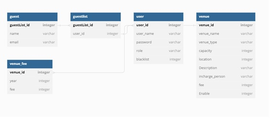

# venue_booking_system
Develop a web-based venue booking system to members for event organization. Provide efficiency of venue booking process.

# Description
Venue booking system is intended to offer venue booking and management, monitoring, tracking, and reporting features. it will be available to Senior Management(Administrator), Staff, and Members. Also apply MVC Model System structure.

# Features requires
Member
Create an account, venue booking
Guest list management
Check personal booking records
Update personal booking records.

Staff
Venue information and timeslot management
Handle member's booking records(approval, check-in/check-out)

Senior Management
Check the analytic & report
User account management

# Database Structure
